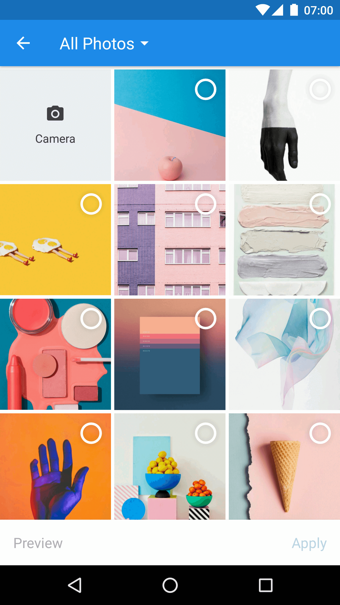
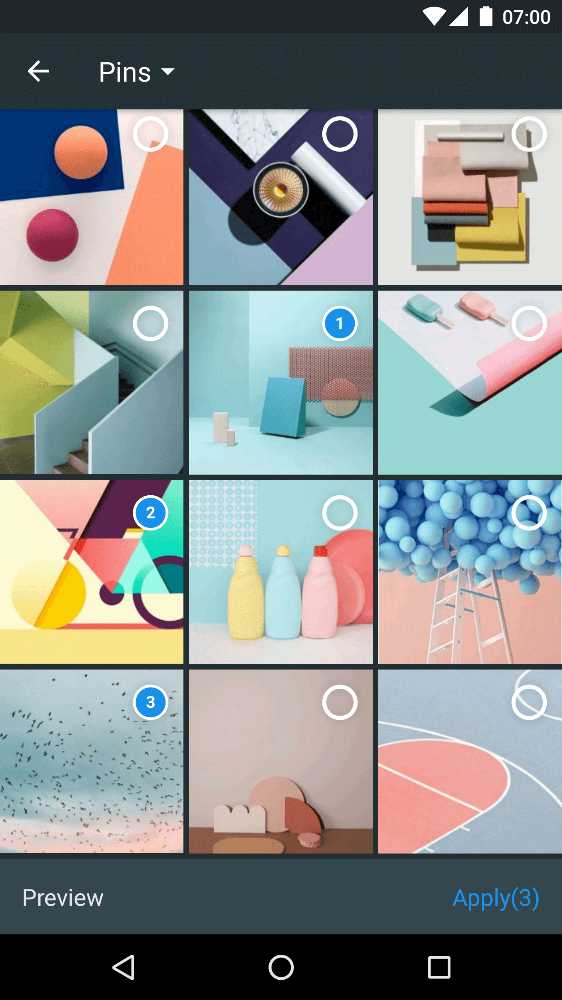

# 描述
基于知乎原Matisse项目， 添加图片批量裁剪，图片批量压缩，支持选择(单选或者多选)图片后裁剪并且压缩，支持自由裁剪，按比例裁剪，并优化图片选择之后的最终结果返回数据封装。

# Matisse
Matisse is a well-designed local image and video selector for Android. You can
- Use it in Activity or Fragment
- Select images including JPEG, PNG, GIF and videos including MPEG, MP4
- Apply different themes, including two built-in themes and custom themes
- Different image loaders
- Define custom filter rules
- More to find out yourself

| Zhihu Style                    | Dracula Style                     | Preview                          |
|:------------------------------:|:---------------------------------:|:--------------------------------:|
| |  | |

| 裁剪1                           | 裁剪2                              | 裁剪3                            |
|:------------------------------:|:---------------------------------:|:--------------------------------:|
| |  | |

## Download
Gradle:

```groovy
repositories {
    jcenter()
}

dependencies {
    implementation 'com.github.Richard-person:Matisse:1.0'
}
```

Check out [Matisse releases](https://github.com/Richard-person/Matisse/releases) to see more unstable versions.

## ProGuard
If you use [Glide](https://github.com/bumptech/glide) as your image engine, add rules as Glide's README says.
And add extra rule:
```pro
-dontwarn com.squareup.picasso.**
```

If you use [Picasso](https://github.com/square/picasso) as your image engine, add rules as Picasso's README says.
And add extra rule:
```pro
-dontwarn com.bumptech.glide.**
```
**Attention**: The above progurad rules are correct.

## How do I use Matisse?
#### Permission
The library requires two permissions:
- `android.permission.READ_EXTERNAL_STORAGE`
- `android.permission.WRITE_EXTERNAL_STORAGE`

So if you are targeting Android 6.0+, you need to handle runtime permission request before next step.

#### Simple usage snippet
------
Start `MatisseActivity` from current `Activity` or `Fragment`:

```java
Matisse.from(SampleActivity.this)
                                .choose(MimeType.ofAll())
                                .theme(R.style.Matisse_Dracula)
                                .autoHideToolbarOnSingleTap(true)
                                .countable(false)
                                .capture(true)
                                .captureStrategy(new CaptureStrategy(true, "com.zhihu.matisse.sample.provider", "test"))
                                .addFilter(new GifSizeFilter(320, 320, 5 * Filter.K * Filter.K))
                                .maxSelectable(8)
                                .originalEnable(false)
                                .maxOriginalSize(10)
                                .imageEngine(new Glide4Engine())
                                .compress(true)                 //是否开启压缩（只支持图片）
                                .compressSize(100)              //超过多少KB才压缩图片
                                .showCompressProgress(true)     //是否开启图片压缩等待提示
                                .isCrop(true)                   //是否开启裁剪
                                .cropOutPutMaxWidth(800)        //裁剪输出最大宽度，单位：px
                                .cropOutPutMaxHeight(800)       //裁剪输出最大高度，单位：px
//                                .cropAspect(1,1)              //裁剪比例
                                .forResult(REQUEST_CODE_CHOOSE);
```

####
注意:
    cropAspect() 和cropOutPutMaxWidth()、cropOutPutMaxHeight()只能使用其一，默认使用cropOutPutMaxWidth()、cropOutPutMaxHeight()，当使用cropOutPutMaxWidth()、cropOutPutMaxHeight()时，为自由裁剪。


#### Themes
There are two built-in themes you can use to start `MatisseActivity`:
- `R.style.Matisse_Zhihu` (light mode)
- `R.style.Matisse_Dracula` (dark mode)

And Also you can define your own theme as you wish.

#### Receive Result
In `onActivityResult()` callback of the starting `Activity` or `Fragment`:

```java
List<SelectedResult> mSelected;

@Override
protected void onActivityResult(int requestCode, int resultCode, Intent data) {
    super.onActivityResult(requestCode, resultCode, data);
    if (requestCode == REQUEST_CODE_CHOOSE && resultCode == RESULT_OK) {
        mSelected = Matisse.obtainResult(data);
        Log.d("Matisse", "mSelected: " + mSelected);
    }
}
```

#### For Glide V4

To be honest,the library can't supply GlideEngine for Glide both v3 and v4 at the same time. (Anyone who
 have good idea to achieve this. PR is welcomed)

GlideEngine with Glide v3 is default.

So if your project's glide version is 4.0+ ,then you must realize GlideEngine by yourself. More details
could refer with [Glide4Engine](https://github.com/zhihu/Matisse/blob/master/sample/src/main/java/com/zhihu/matisse/sample/Glide4Engine.java) in the sample.

